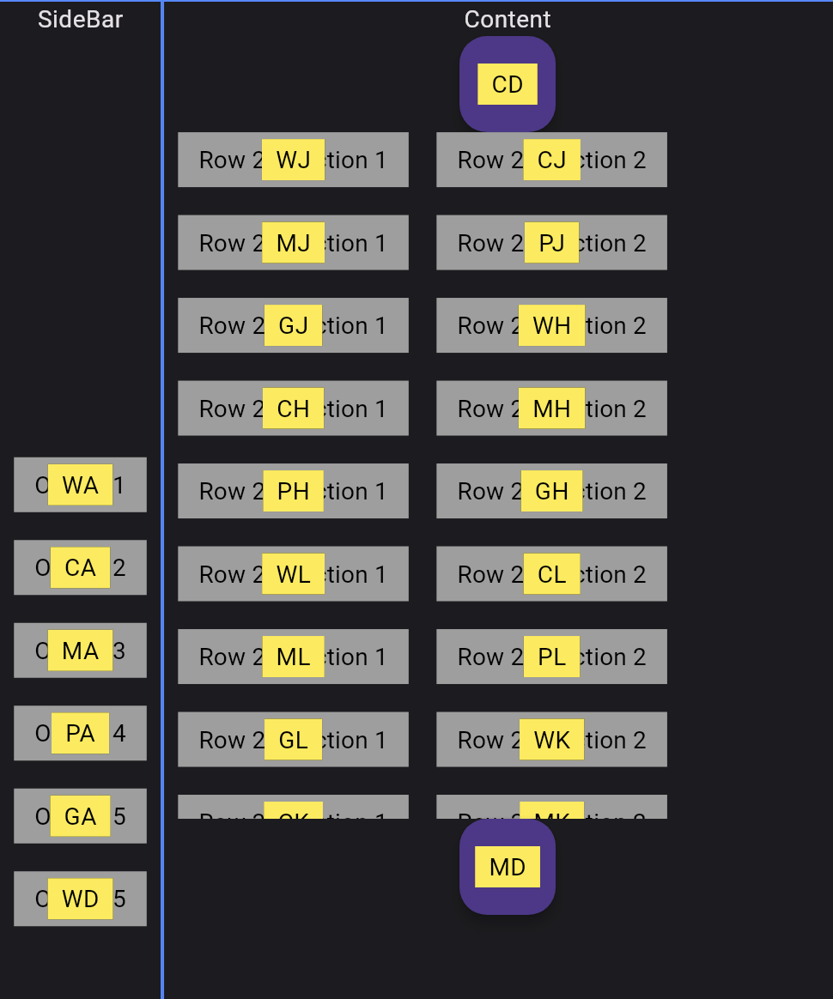

Note: First version, can still be improved a lot.

# vimium

Implements the type-to-click of the amazing [vimium](https://github.com/philc/vimium) browser plugin, which originally looks something like this:

# Example

The example folder implements a basic layout using `VimiumScope` and `VimiumClickNode`.

You can try it out here: https://omnesia.org/vimium_example/

- press `meta+f` to trigger the typing hints (or use the button)
- press `esc` to cancel
- or type out the shown hints to trigger a click and press the buttons

